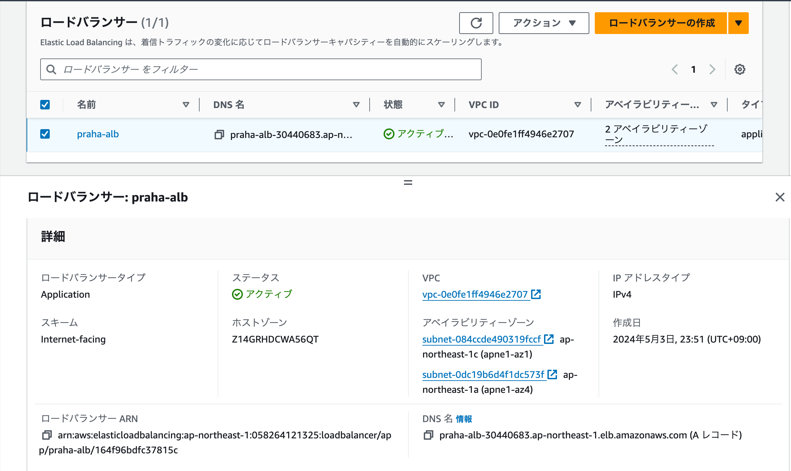

# 冗長化されたWebアプリケーションを作ってみよう

## Nginxを導入

### hello from AZ 1

http://ec2-18-179-111-1.ap-northeast-1.compute.amazonaws.com/

### hello from AZ 2

http://ec2-54-250-21-85.ap-northeast-1.compute.amazonaws.com/

### ALBの導入

http://praha-alb-30440683.ap-northeast-1.elb.amazonaws.com/

### 片方落とす

