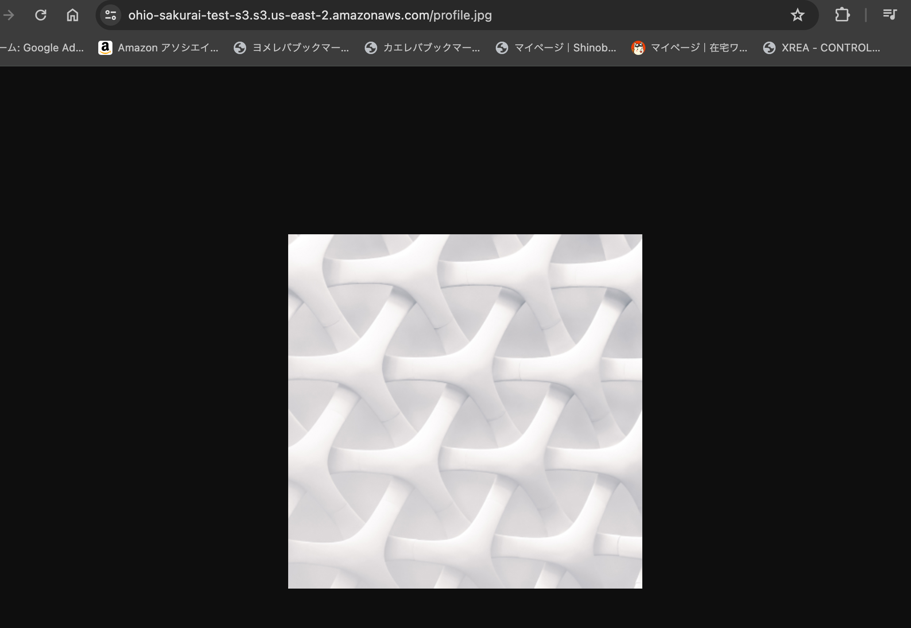
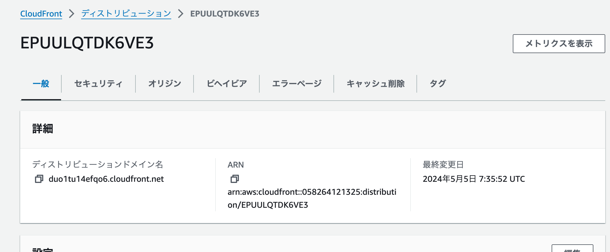
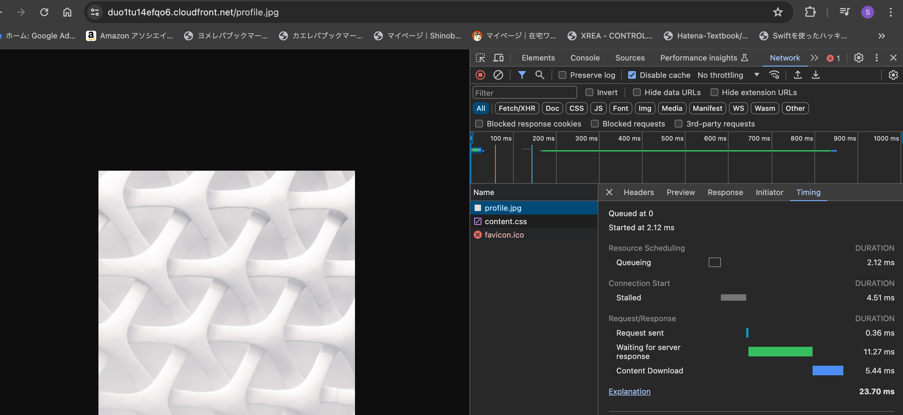
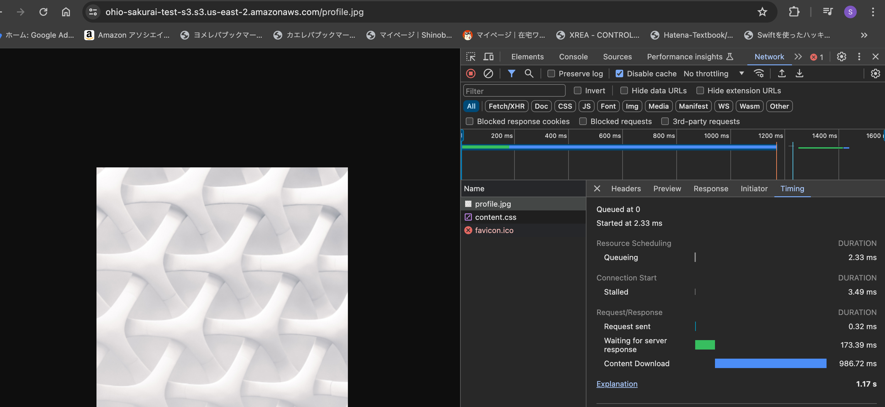

# CDN(CloudFront)について理解して使ってみよう

## 課題1

### CDNの利点
- 世界中に分散されたエッジサーバがオリジンサーバの代わりにコンテンツを配信してくれるため負荷が分散される
- ユーザから地理的に最も近いエッジサーバからコンテンツ配信が行われるため応答速度が速くなる

### オリジンサーバとエッジサーバ

- オリジンサーバはオリジナルのコンテンツが存在するWEBサーバ
- エッジサーバは主に静的コンテンツをキャッシュしたリクエスト配信元クライアントに最も近いところにあるサーバ

### CDNとブラウザキャッシュ

CDN利点
- キャッシュからコンテンツを削除できる
- 初回訪問の際でも近いサーバから配信されるため速度短縮に繋がる
- オリジンサーバの負荷分散できる
- セキュリティ機能を提供できる

CDNの方がいい場合
- 大規模トラフィックの可能性がある場合
- 地理的に広範囲のユーザにサービスを提供する場合
- セキュリティの要求が高い場合

https://www.fastly.com/jp/blog/leveraging-browser-cache-fastlys-cdn

## 課題2（実践）

- 遠いリージョンのS3の画像（オハイオに作成）

　

- CloudFront設定

　

- 速度比較

CloudFront経由 =>　23.70ms

　

CloudFront経由しない =>  1.17s

  
