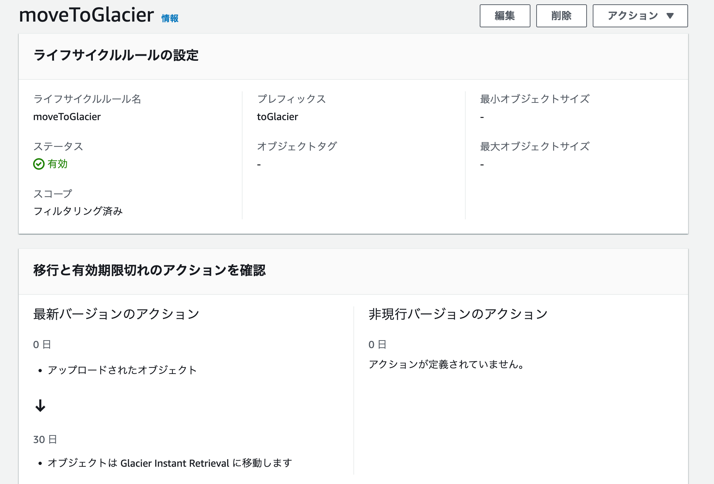
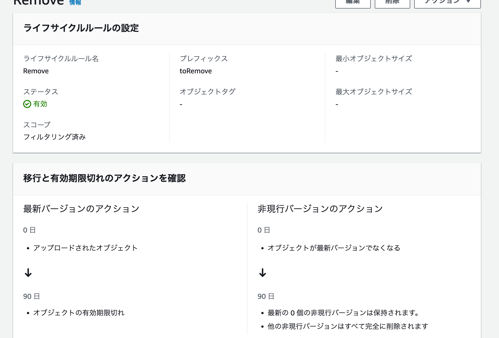
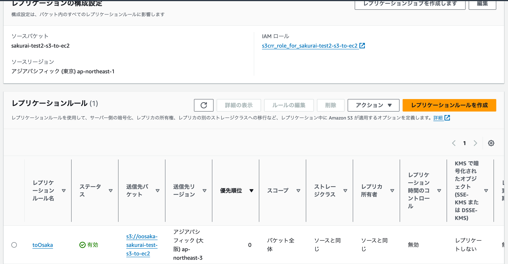
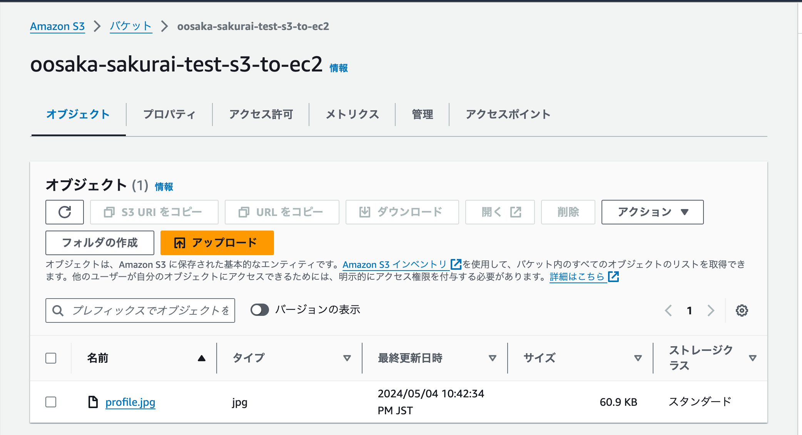
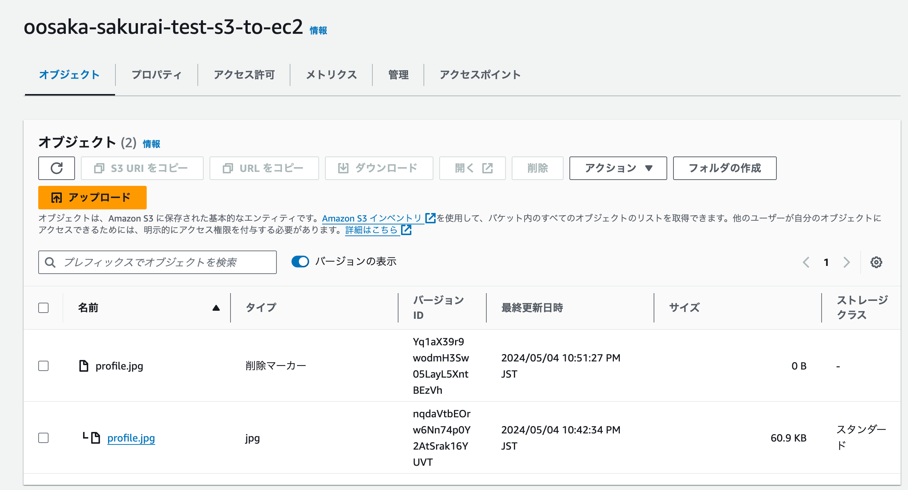

# S3を理解する

## 課題1

## ストレージタイプ

1. S3 Standard	
アクセス頻度が高いデータ向け

2. S3 Intelligent-Tiering*
アクセスパターンが不明または変化する、存続期間が長いデータ向け

3. S3 Express One Zone**	
最もアクセス頻度が高いデータ向け

4. S3 Standard-IA
ミリ秒単位のアクセスを必要とするアクセス頻度の低い、存続期間が長いデータ

5. S3 One Zone-IA**
アクセス頻度の低い、存続期間が長いデータかつ重要度が低い

6. S3 Glacier Instant Retrieval
年に数回アクセスがあり、瞬時に取り出される長期間のデータ

7. S3 Glacier Flexible Retrieval***	
ほとんどアクセスされない低コストのバックアップデータとアーカイブデータ、取得時間が数分から数時間許容できる

8. S3 Glacier Deep Archive***
アクセス頻度が非常に低く、コストも非常に低いアーカイブデータ、取得時間が数時間許容できる

### ほとんどアクセスされないバケットを作成する場合は?

S3 Glacier系から選ぶのが良さそう

### 参考

https://aws.amazon.com/jp/s3/storage-classes/

https://dev.classmethod.jp/articles/should_i_choice_s3_storage_class/

## ライフサイクル

S3バケット内のオブジェクト移行やアーカイブ、有効期限の設定等を自動化するための機能のこと

### 作成から30日経ったら、もっと安いストレージクラスに移動する

### 90日経ったら自動的に消える

## バックアップ

### 「バージョニング」と「レプリケーション」の違い

- バージョニング
単一のオブジェクトの複数のバージョンを保持でき、取得、復元することができる。

- レプリケーション
バケットに新しくオブジェクトをアップロードしたとき、自動的に別のバケットにレプリカオブジェクトを作成することができる。

### レプリケーション実践

### バージョニング

- 削除マーカーを削除して復元