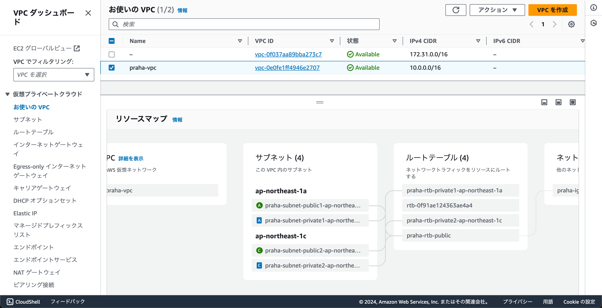
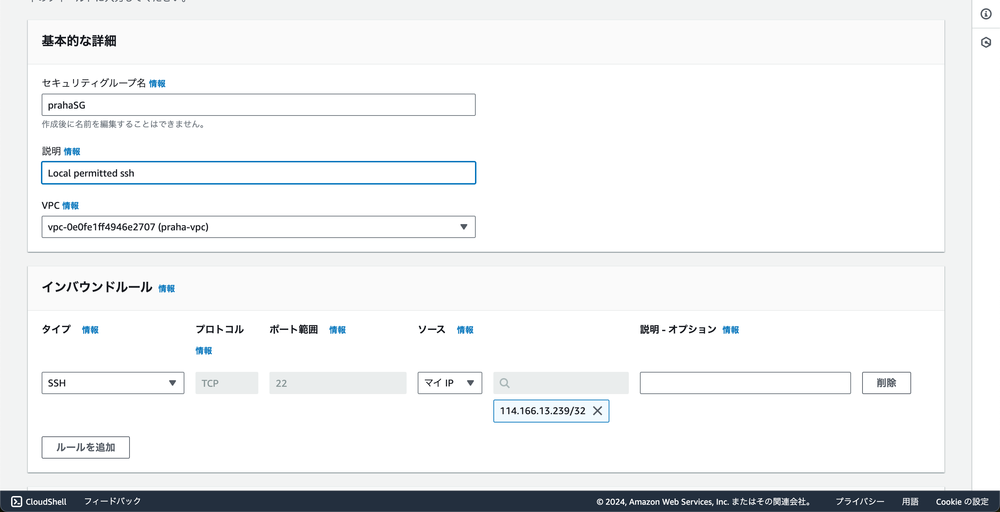

# マルチAZに跨るVPCを構築する

## プライベートサブネットとパブリックサブネットの違い

インターネットアクセスが可能かどうかで分かれている

- パブリックサブネット
  インターネットゲートウェイに接続されて、インターネットへの送受信が可能

- プライベートサブネット
  インターネットに接続していない

## 実技

- VPC作成


- EC2用のSSHセキュリティグループ作成


### パブリックサブネットEC2接続

```
$ ssh -i "../.ssh/test-ec2-key.pem" ec2-user@54.95.150.17
   ,     #_
   ~\_  ####_        Amazon Linux 2023
  ~~  \_#####\
  ~~     \###|
  ~~       \#/ ___   https://aws.amazon.com/linux/amazon-linux-2023
   ~~       V~' '->
    ~~~         /
      ~~._.   _/
         _/ _/
       _/m/'
[ec2-user@ip-10-0-5-66 ~]$ 
```

### パブリックサブネットEC2からプライベートサブネットEC2へ

```
$ scp -i "../.ssh/test-ec2-key.pem" "../.ssh/test-ec2-key.pem" ec2-user@54.95.150.17:~/.ssh
$ ssh -i "../.ssh/test-ec2-key.pem" ec2-user@54.95.150.17
$ chmod 400 ~/.ssh/test-ec2-key.pem 
$ ssh -i "~/.ssh/test-ec2-key.pem" ec2-user@10.0.142.194
,     #_
   ~\_  ####_        Amazon Linux 2023
  ~~  \_#####\
  ~~     \###|
  ~~       \#/ ___   https://aws.amazon.com/linux/amazon-linux-2023
   ~~       V~' '->
    ~~~         /
      ~~._.   _/
         _/ _/
       _/m/'
[ec2-user@ip-10-0-142-194 ~]$
```

### ローカルからプライベートサブネットEC2

```
$ ssh -i "../.ssh/test-ec2-key.pem" ec2-user@10.0.142.194
ssh: connect to host 10.0.142.194 port 22: Operation timed out
```
