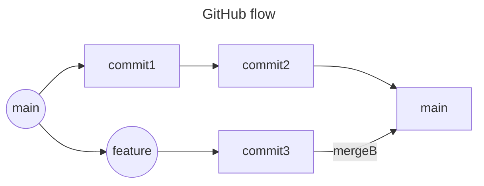
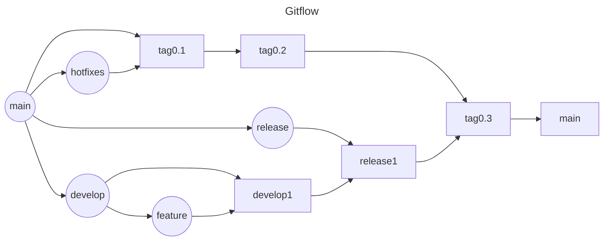

# ブランチ戦略を学ぼう

## 課題1

### メリット

- GiHubflow
  - シンプルで分かりやすい
  - コード修正からマージまでのスピードが速い

- Gitflow
  - 各ブランチの役割が明確
  - リリース管理を厳密にできる

### デメリット

- GiHub flow
  - 検証・本番環境でリリースをずらしたい場合など、検証をしたい場合などに柔軟性がない

- Gitflow
  - フローが複雑なため、全員でルールを理解して使わないと間違える可能性がある
  - マージサイクルが遅い

### 参考

特別な理由なしにgit-flowを新規採用するべきではない
https://qiita.com/ktateish/items/76ca0130aec3be05376c

### トランクベース

それぞれのデベロッパーが自分の作業を小さなバッチに分割し、その作業を 1 日に少なくとも 1 回（場合によっては数回）トランクにマージします。このアプローチの主な違いはスコープです。通常、機能ブランチには複数のデベロッパーが関与し、作業が終わるまでに数日から数週間かかります。対照的に、トランクベース開発のブランチは数時間以内で終わり、多くのデベロッパーが個々の変更を頻繁にトランクにマージします。

#### メリット

開発スピードの向上とデプロイまでの時間短縮を実現できる

#### デメリット

マージリクエスト以外の品質担保の仕組みが必要

#### 採用判断

自動テスト、スピード感のあるレビュー、各課題を小さいレベルまで分割できる、リードできる経験者がいる、ペアプロなど、開発体制が整っている場合はトランクベースを採用できる。大規模な開発には導入しづらそうなイメージ。