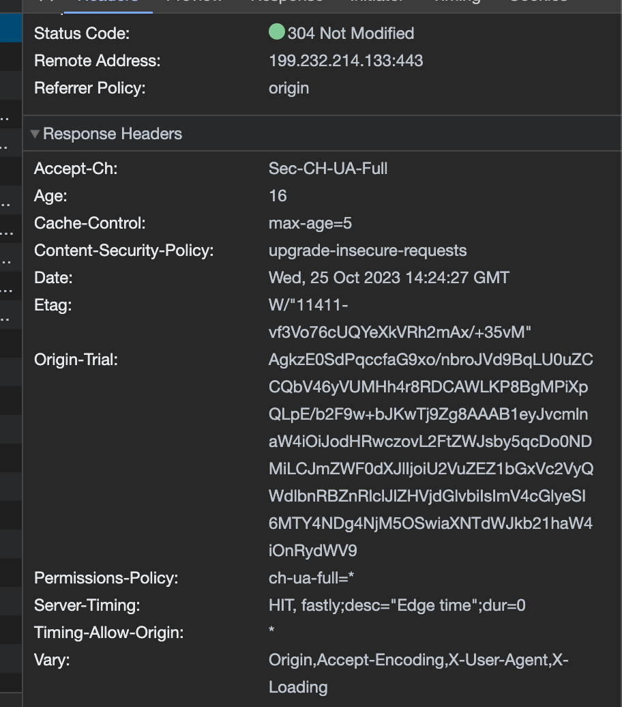

# キャッシュについて理解する

## 課題1（質問）

### なぜキャッシュが必要なのか、説明してください

- データの取得を効率化するため
例えば、ウェブサイトやアプリの読み込みが遅い場合、UXを損ねてしまう。キャッシュがあることで高速化できる

https://sematext.com/glossary/cache/

### キャッシュヒット率とは何でしょうか？どのように向上できるでしょうか？

- キャッシュ内に存在するデータのうち、実際に使用されたデータの割合を示す指標
- Cache Hit Rate = Cached Read / Total Read * 100%

- 向上方法(Webの場合)
1. キャッシュサイズを増やす
1. VaryヘッダーにUserAgentではなく、PC・Mobile２種類など絞って設定する
2. ETagヘッダーを設定する
3. Cache-controlヘッダに適切なmax-ageを設定する
4. キャッシュキーに含むCookieを選別する
5. クエリパラメータの大文字小文字統一、並び順の統一

#### 参考

https://www.stream.co.jp/blog/blogpost-38692/

### キャッシュの種類

- ブラウザキャッシュ
  ブラウザにダウンロードされた画像、ビデオ、CSS、JavaScriptなどのWebページリソースを保存する領域。
- サーバーキャッシュ
  サーバーが同一リクエストに対するレスポンスを保存する領域。
- DNSキャッシュ
  DNSによるIPアドレスやドメイン名の問い合わせ結果を保存する領域。
- プロキシキャッシュ
  クライアントとサーバーの中間に配置されるプロキシサーバーにある、クライアントへのサーバからのレスポンスを保存する領域。
- データベースキャッシュ
  データベースに対するクエリの結果を保存する領域

### キャッシュのヘッダー

1. Cache-Control：キャッシュを制御するための指示を保持するヘッダ。
2. Expires：キャッシュの有効期間の日時を設定する。無効な日付の場合は有効期限切れとみなす。max-ageが設定されている場合は無視される。
3. If-None-Match: クライアントが過去に受信してキャッシュに保管しているコンテンツをリクエストする際に、最後に受信したときにサーバから送られてきたETagを記載する。サーバは当該コンテンツの現在のETagと比較し、異なる場合はステータスコード「200 OK」と共に更新されたコンテンツを送信する。同じ場合は「304 Not Modified」を返し、コンテンツ本体は送信しない。クライアントは手元にキャッシュされているコンテンツを利用し続ける。

### ブラウザのキャッシュ

- Chrome
合計ディスク容量の最大80％
上限を超えると、使用頻度の低いデータを削除

- Firefox
空きディスク容量の50％
上限を超えると、使用頻度の低いデータを削除

- Safari
約1GB
上限を超えると、ユーザーにプロンプトを表示し、200MBずつ制限を増やす

https://web.dev/articles/storage-for-the-web?hl=ja

### 動的なサイトをキャッシュするなら、expiresは使わない方が良い理由

- Expiresの場合、情報が更新された場合も期限を過ぎるまでは古いデータがヒットしてしまうため
- Etag/If-None-Match/Last-Modifiedを使う

### ブラウザのキャッシュ例

1. https://developer.mozilla.org/ja/docs/Web/HTTP/Headers/Cache-Control
2. https://ja.wikipedia.org/wiki/Wikipedia:%E4%BB%8A%E6%97%A5%E3%81%AE%E4%B8%80%E6%9E%9A
3. https://ameblo.jp/hbnizm31/entry-11772043169.html

#### キャッシュの流れ

・ブラウザ(private)キャッシュの流れ
対象のWEBサイトにアクセスする
レスポンスからリソース(html,css,js,画像など)をローカルに保存する
再度、対象のWEBサイトにアクセスする
ブラウザはローカルに保存されたレスポンスのリソースを参照し、リクエストは送らない

・CDN(shared)キャッシュの流れ
対象のWEBサイトにアクセスする
レスポンスからリソース(html,css,js,画像など)を中間サーバに保存する
再度、対象のWEBサイトにアクセスする
ブラウザは中間サーバに保存されたレスポンスのリソースを参照し、オリジンサーバにはリクエストは送らない

### 参照

https://qiita.com/bellbind/items/1af4c3dba0c5b0584c69

## 課題２（実装）

[実装](./app.js)

## 課題３

- リアルタイム性のあるサービス
- チャットするページ、メモを取るページ、フォーム、カート、カードなどセキュリティ的な個人情報を含むページ

## 課題４（クイズ）

1. Cache-Control: no-cacheに指定するとレスポンスは保存されますか？
A. 保存される。保存したくないならno-storeを指定。さらにプライベートなコンテンツの場合はprivateを指定する。

https://developer.mozilla.org/ja/docs/Web/HTTP/Headers/Cache-Control#%E6%A0%BC%E7%B4%8D%E3%82%92%E9%98%B2%E6%AD%A2

1. 同じURLでもコンテンツが別の場合、例えば日本語・英語のコンテンツがある場合、別々にキャッシュするにはどのヘッダーを利用すればいいですか？
A.Vary ヘッダー。Accept-Language を指定する。

https://developer.mozilla.org/ja/docs/Web/HTTP/Caching#vary

1. レスポンスヘッダーにCache-Controlをつけないと既定値はキャッシュされることになっているでしょうか？
A.ヒューリスティックキャッシュとなる可能性があり、場合によってはキャッシュされる(挙動はブラウザによる)。なので明示的に指定すべき。

https://developer.mozilla.org/ja/docs/Web/HTTP/Caching#既定の設定

https://zenn.dev/kawakawaryuryu/articles/75af6ae44d2939