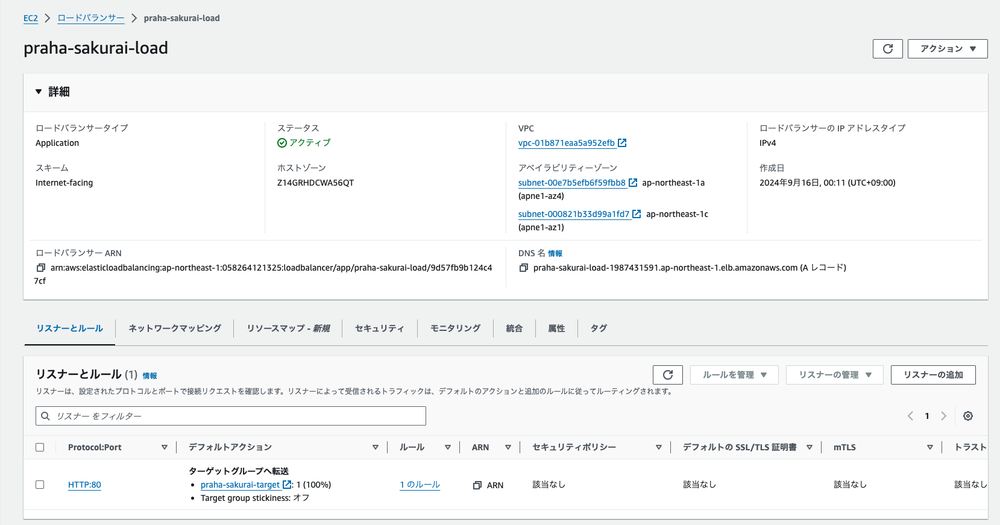
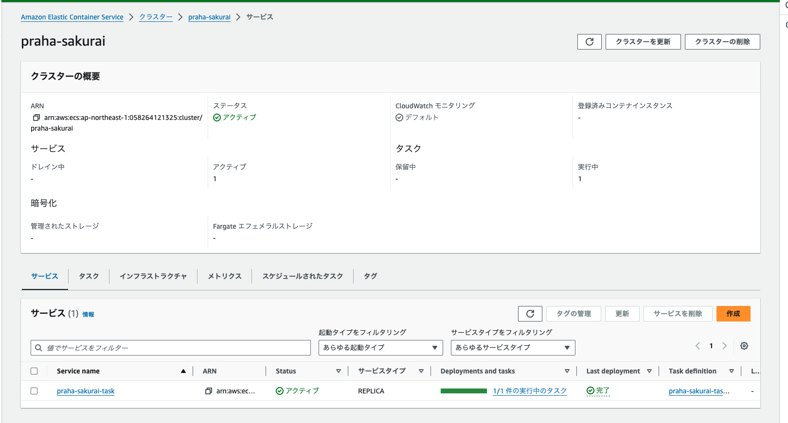
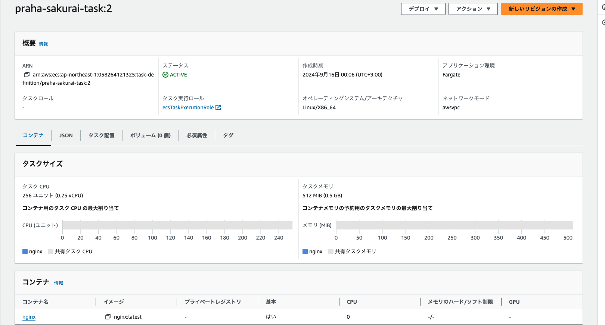
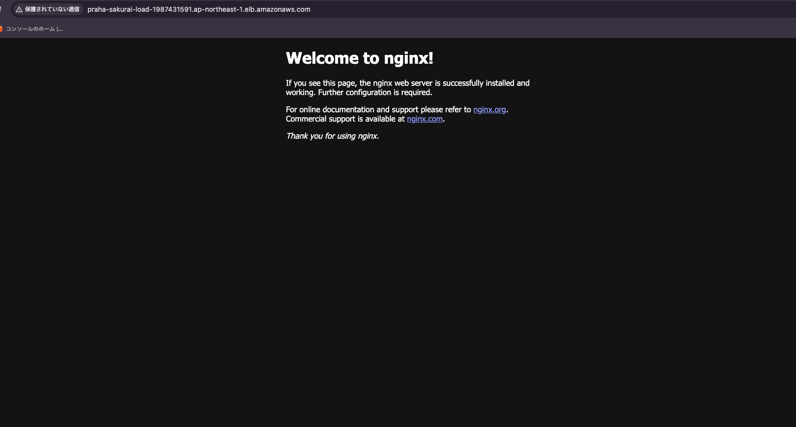
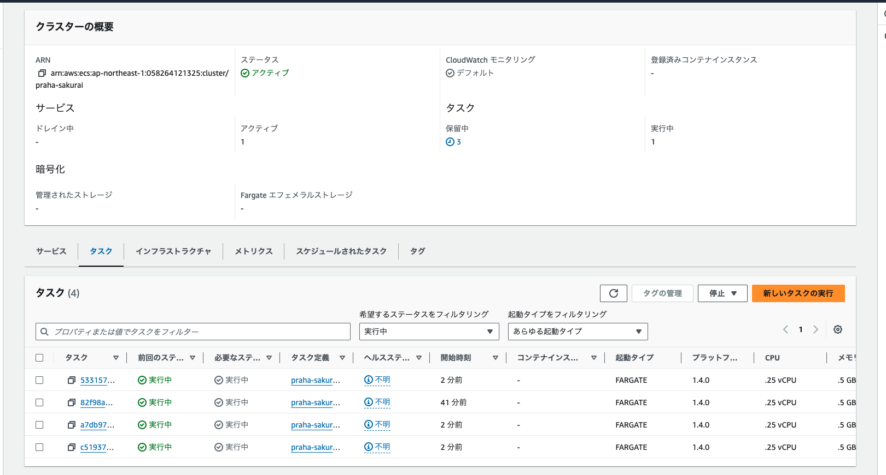

# ECS Fargateで簡単にスケールできるWebアプリケーションを作ってみよう

## Fargateのサーバレスとは？

インフラストラクチャの管理（サーバー管理、リソース割り当て、スケーリング）が不要という意味

## Fargateのクラスタ、サービス、タスクとは？

- クラスター
サービスとタスクを論理的にグループ化したもの

- サービス
クラスター内でタスクの実行・管理を行う。実行するタスク数の設定・管理ができる

- タスク
タスク定義に基づいてコンテナを起動する(タスク定義のインスタンス化)

https://docs.aws.amazon.com/ja_jp/AmazonECS/latest/developerguide/Welcome.html

## Fargateにデプロイ（Nginx,ALB）

- ALB設定

- Cluster&Service

- Task

- Nginx

## Apache Benchで負荷

### タスク数を1->4へ変更

[ApacheBenchで負荷をかける](apacheBench.md)

### 結果

- タスク１

| 指標                            | テスト1 | テスト2 | テスト3 |
| ------------------------------- | ------- | ------- | ------- |
| リクエスト数                    | 500     | 3,000   | 10,000  |
| 同時接続数                      | 10      | 50      | 100     |
| 総実行時間 (秒)                 | 1.001   | 0.939   | 2.087   |
| 1秒あたりのリクエスト数         | 499.52  | 3194.95 | 4790.83 |
| リクエストあたりの平均時間 (ms) | 20.019  | 15.650  | 20.873  |
| 転送速度 (KB/秒)                | 416.11  | 2661.41 | 3990.79 |

- タスク4

| 指標                              | テスト1 | テスト2 | テスト3 |
| --------------------------------- | ------- | ------- | ------- |
| リクエスト数                      | 500     | 3,000   | 10,000  |
| 同時接続数                        | 10      | 50      | 100     |
| テスト実行時間 (秒)               | 0.636   | 1.189   | 2.050   |
| 秒間リクエスト数 (平均)           | 785.75  | 2523.62 | 4878.14 |
| リクエストあたりの時間 (ms, 平均) | 12.727  | 19.813  | 20.500  |
| 転送速度 (KB/秒)                  | 654.53  | 2102.19 | 4063.53 |