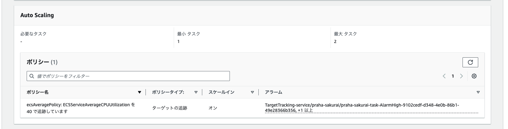
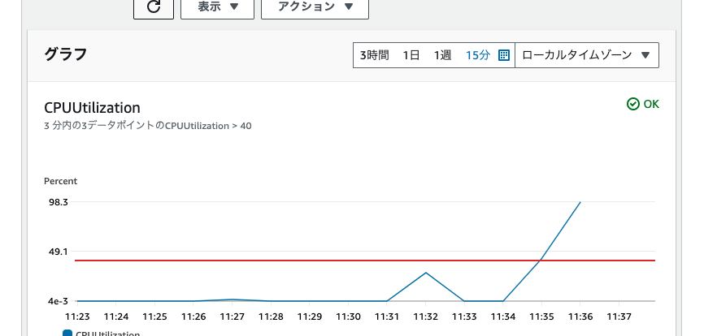
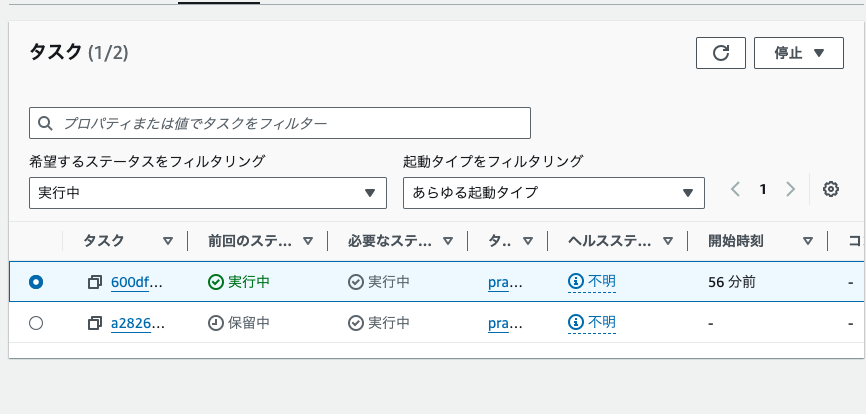
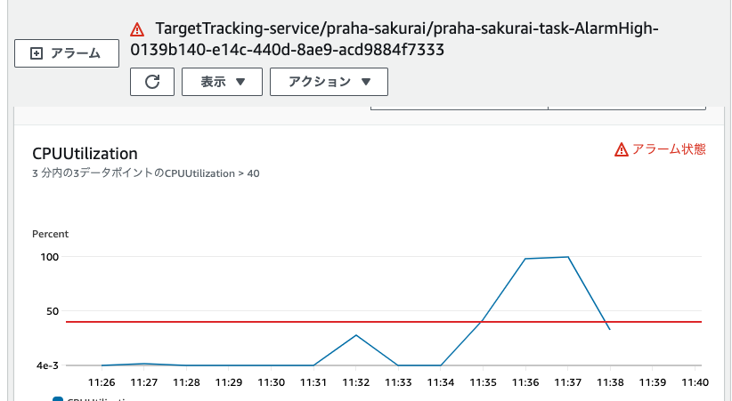
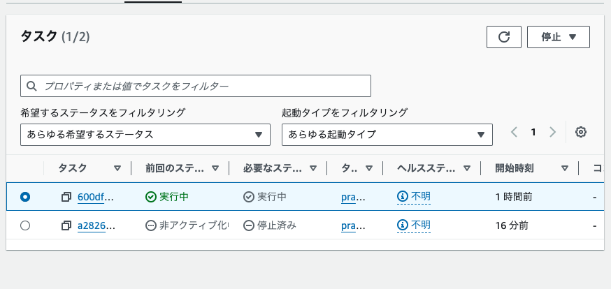

# ECSのAutoScalingを設定して、実際に負荷を与えてスケールするか試してみよう

## AutoScaling設定

- 設定

- CPUが40%を超える

- CPUが36%を下回る

## 備考

オートスケーリングで自動で作られたターゲットポリシーを設定していたが、すぐにスケールイン・アウトしなかった。
デフォルトでは3分間で3回40%を上回らないとスケールアウトしないようになっていた、また15分間で15回36%を下回らないとスケールインしないようになっていた。
実際に設定するときは、この辺りの調整が必要。