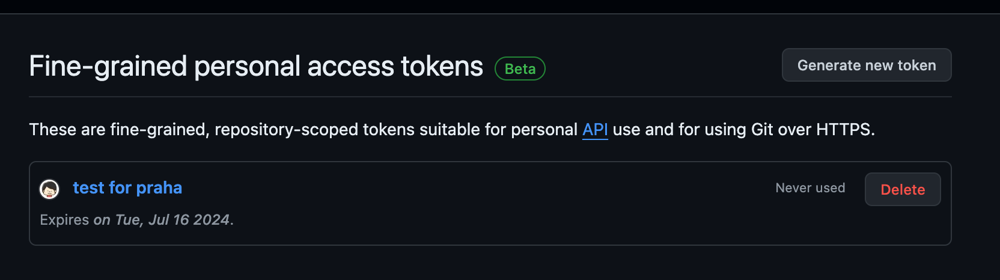

# 外部APIを活用してみよう

## 課題１

### Personal access token生成

### 違い

#### Personal access tokens
ユーザーアカウントに紐付けられているトークン。
自分の GitHubアカウントで閲覧可能な情報にアクセスできる。

- 用途
個人用に GitHub REST API を使用する場合。

#### GitHub Apps

個人アカウントおよび自分が所有する Organization にインストールできる。
ユーザーと関係なく動作することができる。
OAuth Appsよりも優先される。

- 用途
Organization で、または他のユーザーの代わりに API を使用する場合。
CI/CDや自動化ツールの開発、細かなアクセス制御など。

#### OAuth Apps

OAuth 2.0を使用してユーザーのGitHubアカウントにアクセスを許可する。
OAuth apps はユーザーに代わってのみ動作でき、そのユーザーが持つ権限の範囲内でリソースを操作できる。
権限スコープや有効期限などのセキュリティ面でGithubAppsの方が優れるため推奨される。

- 用途
> Enterprise オブジェクトなど、Enterprise レベルのリソースにアプリからアクセスする必要がある場合、GitHub App ではまだ Enterprise に対してアクセス許可を付与できないため、OAuth app を使う必要があります。
サードパーティのWebサービスがGitHubユーザーのデータにアクセスする必要がある場合。

#### 参考

https://docs.github.com/ja/rest/authentication/authenticating-to-the-rest-api?apiVersion=2022-11-28

https://qiita.com/dowanna6/items/cfe3fc88643d3ef95a37

### 実装

https://github.com/shun57/github-api/pull/1

#### 認証トークンをコードに直接書くのはNG、なぜ？

- Githubのリポジトリをpublicにしていた場合にtokenを盗まれ、不正アクセスされる可能性があるため

[誤公開されたGitHubトークンを使い、ニューヨークタイムズのソースコードが盗まれる](https://codebook.machinarecord.com/threatreport/33421/)

#### 参考

https://github.com/octokit/rest.js

https://docs.github.com/ja/rest/authentication/endpoints-available-for-fine-grained-personal-access-tokens?apiVersion=2022-11-28