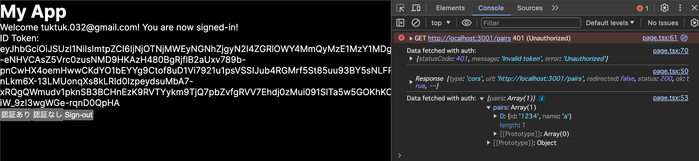

# FIrebase Authentication（IDaaS）を使ってみる

## 課題1

https://github.com/shun57/praha-challenge-ddd/pull/24

1. frontend配下でnpm run dev
2. .dokcer配下でdocker compose up
3. localhost:3000/signinでGoogleログインをする
4. localhost:3000/mypageでそれぞれ認証なし・ありボタンを押下する
5. 検証ツールでコンソールの出力を確認する

## 課題2

### セッションクッキー認証の使い所

例えばECサイトのようにユーザーと動作を紐付けたい場合に便利。
トークンの場合、セキュリティ上有効期限を長く持てないので、カートの情報が消えてしまい、ユーザビリティを損ねる可能性がある。
また、APIではないウェブアプリケーションの場合は、セッションクッキーの方がシンプルに認証できる。

### アクセストークンが盗まれて不正ログインされたら？

- Firebase AdminなどのIDaaSでトークンを取り消せるAPIが用意されていれば取り消しを実施する
https://firebase.google.com/docs/auth/admin/manage-sessions?hl=ja

- 上記以外の場合、ユーザーが特定できていれば該当ユーザ削除や無効などを行う
- 該当リクエストのIPがわかればIP制限を行う

### 参考

[セッションベース認証とトークンベース認証の違いを分かりやすくまとめてみる](https://zenn.dev/tanaka_takeru/articles/3fe82159a045f7)