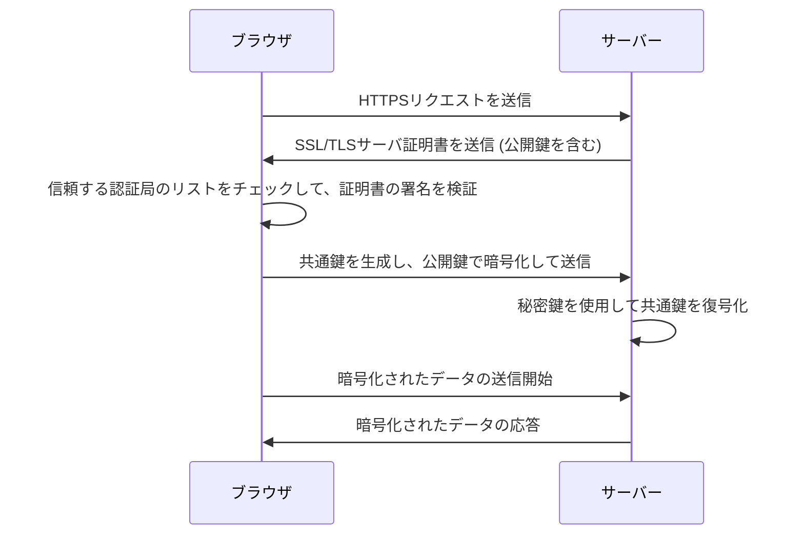

```mermaid
sequenceDiagram
    participant ブラウザ
    participant サーバー

    ブラウザ->>サーバー: HTTPSリクエストを送信
    サーバー->>ブラウザ: SSL/TLSサーバ証明書を送信 (公開鍵を含む)
    ブラウザ->>ブラウザ: 信頼する認証局のリストをチェックして、証明書の署名を検証
    ブラウザ->>サーバー: 共通鍵を生成し、公開鍵で暗号化して送信
    サーバー->>サーバー: 秘密鍵を使用して共通鍵を復号化
    ブラウザ->>サーバー: 暗号化されたデータの送信開始
    サーバー->>ブラウザ: 暗号化されたデータの応答


```

## 参照

https://www.kagoya.jp/howto/it-glossary/security/ssl/
