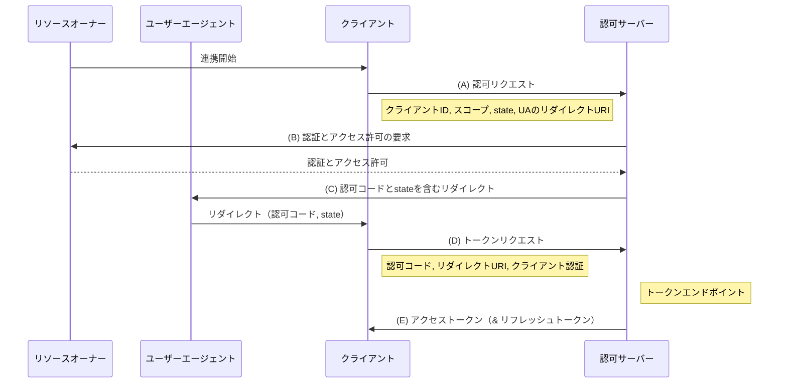

## フロー

1. (A)
クライアントがリソースオーナーのユーザーエージェントを認可エンドポイントに送ることで, フローが開始する. このときクライアントは, クライアント識別子, リクエストスコープ, ローカルステート, および認可サーバーがアクセス許可 (あるいは拒否) 取得後にユーザーエージェントを戻すリダイレクトURIをリクエストに含める.
2. (B)
認可サーバーは (ユーザーエージェント経由で) リソースオーナーを認証し, リソースオーナーにアクセス要求の許可/拒否をたずねる.
3. (C)
リソースオーナーがアクセスを許可した場合, 認可サーバーは予め与えられていた (リクエストもしくはクライアント登録時に指定される) リダイレクトURIを用いて, ユーザーエージェントをリダイレクトさせてクライアントに戻す. リダイレクトURIには、 認可コード, クライアントから事前に送られたローカルステートが含まれる.
4. (D)
クライアントは前のステップで取得した認可コードを認可サーバーのトークンエンドポイントに送ることでアクセストークンを要求する. このとき, クライアントは認可サーバーとの間で認証を行う. またクライアントは認可コード取得時に使用したリダイレクトURIを検証のためリクエストに含める.
5. (E)
認可サーバーはクライアントを認証し, 認可コードを検証し, 受け取ったリダイレクトURIがステップ (C) で使用したURIと同一であることを確かめる. その結果, 正当である場合, 認可サーバーはアクセストークンと任意でリフレッシュトークンを返却する.

## 参照

https://openid-foundation-japan.github.io/rfc6749.ja.html

https://note.com/aiya_en/n/n5f927e6dcff7