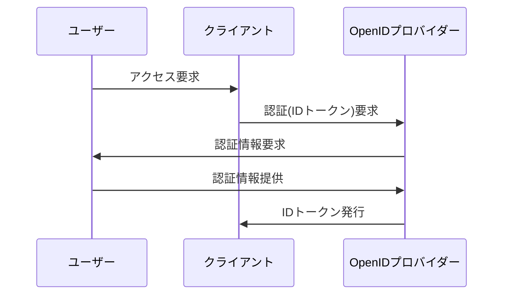

```mermaid
sequenceDiagram
    participant User as ユーザー
    participant Client as クライアント
    participant AuthorizationServer as OpenIDプロバイダー

    User->>Client: アクセス要求
    Client->>AuthorizationServer: 認証(IDトークン)要求
    AuthorizationServer->>User: 認証情報要求
    User->>AuthorizationServer: 認証情報提供
    AuthorizationServer->>Client: IDトークン発行
```

## 参照

https://www.openid.or.jp/document/

https://solution.kamome-e.com/blog/archive/blog-auth-20221108/

https://qiita.com/TakahikoKawasaki/items/498ca08bbfcc341691fe