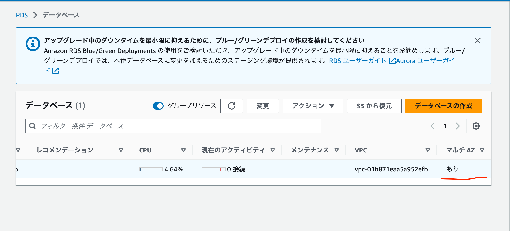
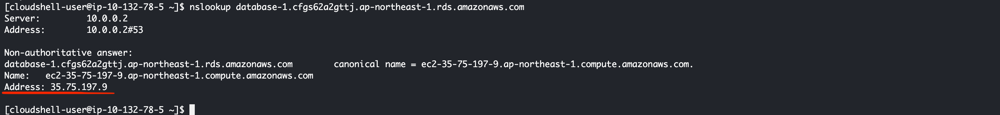
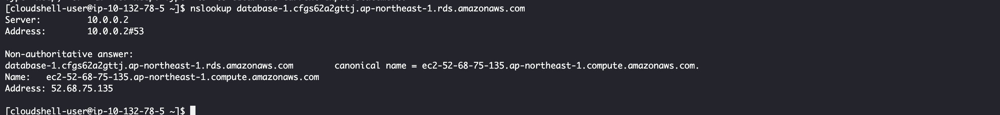

# RDSを冗長化してみよう

## 課題1

### マルチAZ

### フェイルオーバー再起動時のアクセス

できない

※なぜか再現できず、、

https://dev.classmethod.jp/articles/how-amazon-aurora-failover-affect-downtime/

### フェイルオーバーでサブネットは変わる？

変わる

- フェイルオーバー前

-フェイルオーバー後

